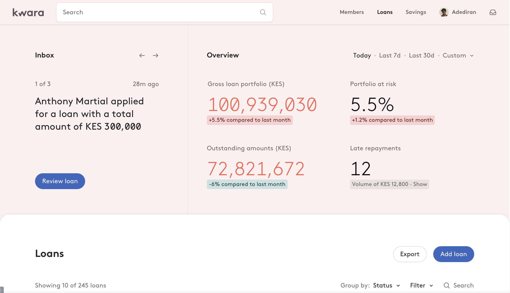

# Inbox

## Installation

After you have cloned:

```sh
cd inbox-slider
yarn && yarn start
```

On a different shell start the server:

```sh
yarn serve
```

## Exercise

Here are 2 visuals for you:

- Inbox: a notification slider. This is the component the exercise revolves around.


- Inbox-page: that shows an example of placement of the Inbox within a page. **This is just for your reference and you are NOT expected to build any of this.**



The Slider has been already implemented for you in the current repo.

Clone it and follow the instructions to get it up and running.
If everything goes smoothly you will have a local version of the slider visibile on http://localhost:3000/

For this exercise we will simulate a real world situation at Kwara.
The slider is currently working and making calls to an endpoint that returns Loan data `/api/inbox/loans`.

We now have to support a second endpoint that returns data related to the Till, `api/inbox/till`.
This is your task for today, making sure that the existing `<Inbox />` Component works for both use cases.

You are free to approach the task in any way that makes sense for you.
Feel free to modify and restructure any of the existing files in the `src/` directory to make sure that the component adapts to the new requirements.
You are encouraged to change the existing implementation and suggest any improvement to make it more solid and future proof.

Some details for you to consider:

- Since the interaction is very simple, please avoid adding any state management library (like Redux, Mobx or similar).
- Clear separation of concerns.
- This is very important, solve it like you'd do considering a bigger picture of an existing codebase that will grow and change in the future in ways that are hard to predict today.
- We appreciate if you could git commit each relevant step of your development.
- There's no hard deadline, feel free to take as much or as little time as you wish.
- Don't try and make it perfect at all cost though. Some rough edges here and there are totally ok. If you feel something can be improved add your view about it in the readme and we can just talk through it on our next call. As long as there's enough for us to review and to see where your strengths are it will be alright.

Please add a quick README alongisde this one, where you clarify your general approach. We are really interested in what you think about the current implementation and your suggestions to make it better.

If you have any question just write me an email and i will reply as soon as possible.

Once finished you can open a PR to this same repo and notify us that it's ready for review.
Good luck!
